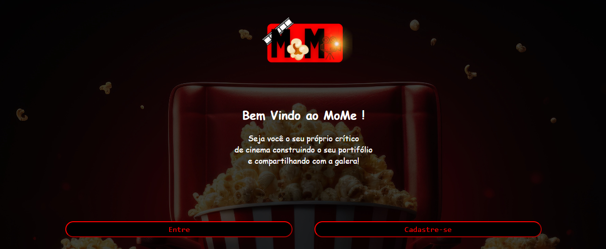
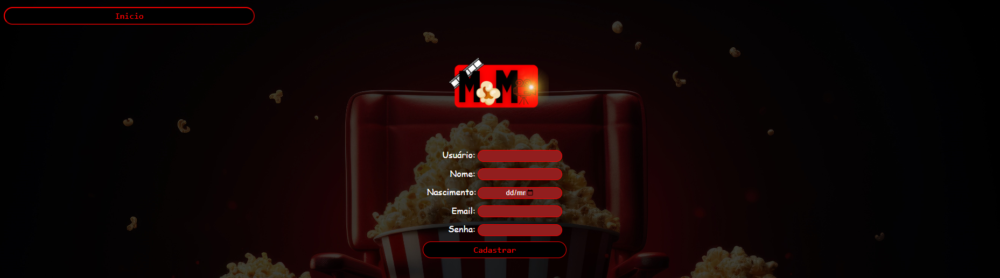
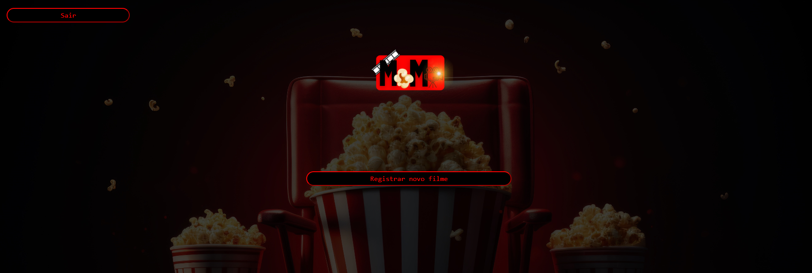
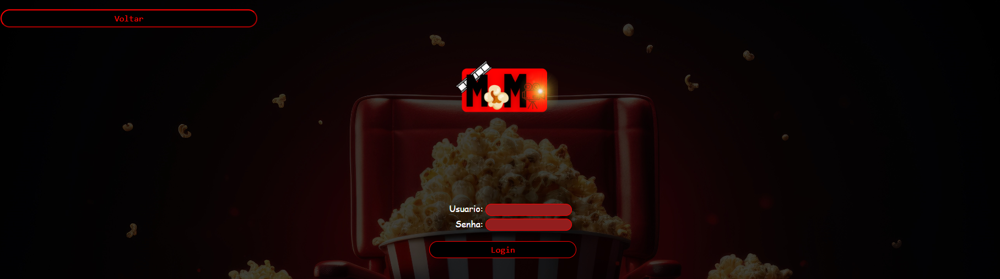

# MoMe - Movies Memories

O MoMe - Movies Memories funciona como uma biblioteca para armazenar seus filmes preferidos com a suas repectivas notas.

## Índice

- [Sobre o Projeto](#sobre-o-projeto)
- [Funcionalidades](#funcionalidades)
- [Tecnologias Utilizadas](#tecnologias-utilizadas)
- [Pré-requisitos](#pré-requisitos)
- [Instalação](#instalação)
- [Como Usar](#como-usar)
- [Licença](#licença)
- [Contato](#contato)
  
## Sobre o Projeto

O **MoMe - Movies Memories** é um web app projetado para funcionar como uma biblioteca pessoal, onde os usuários podem armazenar seus filmes favoritos e atribuir notas para cada um deles. A ideia é criar um espaço onde você pode facilmente organizar, gerenciar e relembrar dos filmes que assistiu, junto com as suas avaliações pessoais.

Com uma interface simples e intuitiva, o MoMe facilita a adição de novos filmes e exibição de uma lista completa dos seus títulos preferidos, permitindo que você personalize a experiência de acordo com suas preferências cinematográficas. Ideal para cinéfilos que gostam de manter um registro dos filmes assistidos e atribuir uma nota como recordação.

## Funcionalidades

- Liste aqui as principais funcionalidades do seu web app.
  - Sistema de Contas
  - Visualização rápida de trailers dos filmes assistidos
  - Salavamento automático no navegador
  
## Tecnologias Utilizadas

- [Linguagem](#): JavaScript, HTML e CSS.

## Pré-requisitos

Antes de iniciar, certifique-se de atender aos seguintes requisitos:

- Um dispositivo móvel obterá maior estabilidade e melhor visibilidade.

## Instalação

Baixe os arquivos e execute a landing.html para iniciar uma experiência completa e sem erros.
Recomenda-se usar os navegadores Google Chrome e Opera.

## Como Usar

Crie uma conta através do "Cadastro"

Adicione seus filmes através do "Registrar um novo filme".

Altere sua nota através da barra de registro de nota abaixo do trailer informado e seu título por meio do "Editar" do filme escolhido.

Para Salvar use "Sair" e faça o login quando quiser em "Login"

## Licença
MoMe está sendo disponibilizado como código aberto.

## Contato
- Desenvolvido por João Carlos Martins, Evelyze Reis e Esther Magalhães (Estudantes de Engenharia de Computação - CEFETMG).

- Para mais contatos e demais sujetões : 
  - @joaocarlos.fm on Instagram

